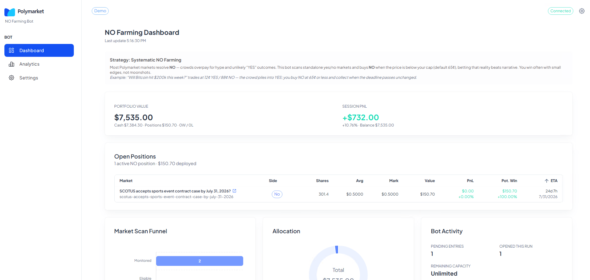

# Polymarket NO Farming Bot

**Systematic NO strategy for Polymarket** — live dashboard + Python trading engine.

Trade the same structural edge used by successful Polymarket NO farmers: crowds overpay for unlikely **YES** outcomes; reality resolves **NO** far more often than the price implies.

> **Disclaimer:** For educational and entertainment purposes only. Not financial advice. You can lose money. Trade at your own risk.

---

## Dashboard



Live portfolio, open positions, market funnel, session PnL, and Polymarket links — demo mode included.

---

## Strategy overview (beginner-friendly)

### What is Polymarket?

[Polymarket](https://polymarket.com) is a prediction market. Every market is a yes/no question — for example: *“Will Bitcoin hit $200k this week?”*

- **YES** = you think it will happen  
- **NO** = you think it will **not** happen  

Prices move between **$0.01** and **$0.99** (shown as **1¢–99¢**). If you are right at resolution, your side pays **$1.00 per share**.

---

### What is “NO farming”?

Many markets attract hype on the **YES** side (“moonshot” bets). That often pushes YES up and leaves **NO** cheaper than it should be.

**NO farming** means: find those markets and buy **NO** at a good price — then let time and resolution work for you. You are not betting on drama; you are betting that **nothing dramatic happens**.

This bot automates that idea:

1. **Scan** active Polymarket yes/no markets  
2. **Filter** for setups where NO is below your price cap (default **65¢**)  
3. **Buy** a small slice of your cash each time (default **2%** per trade)  
4. **Hold** until the market resolves — many resolve **NO**

---

### Walkthrough example

**Market:** *“Will Bitcoin hit $200k this week?”*

| Side | Price | Meaning |
|------|-------|---------|
| YES | 12¢ | Crowd pays for a long shot |
| NO | 88¢ | “Probably won’t happen” |

The bot does **not** chase YES at 12¢. It looks for NO entries at **≤ 65¢** (your cap). If it finds a similar market where NO is cheap enough, it buys a small position. When the week ends and BTC did not hit $200k, **NO pays $1** — that is the edge.

**Think of it like:** many people buy lottery tickets (YES). You quietly collect when the unlikely thing does not happen (NO).

---

### Key settings (plain English)

| Setting | Default | What it means |
|---------|---------|----------------|
| **Max entry price** | 65¢ | Only buy NO if it costs this or less |
| **Trade size** | 2% | Each bet uses 2% of available cash — keeps risk spread out |
| **Demo mode** | On | Paper money + real market data — learn without placing real orders |
| **Live mode** | Off | Turn on when you add a wallet and want real trades |

Change everything from **Settings** in the dashboard — no code edits required.

---

### Learn from a real trader

This style of systematic NO farming is used in production by profitable Polymarket traders. Study how they pick markets and size positions:

**Profile:** https://polymarket.com/@filthybera  

This bot runs the same *type* of playbook — automated, configurable, and self-hosted on your machine.

---

## Why this bot

| Edge | What you get |
|------|----------------|
| **Fully customizable** | Price cap, trade size, slippage, scan intervals, and wallet — all from **Settings**, hot-reloaded to the engine. |
| **Built for profitability** | NO-farming math + disciplined sizing — designed for repeatable small wins, not lottery tickets. |
| **Live Polymarket data** | Real market funnel, positions, and one-click market links — not fake dashboard numbers. |
| **Demo → live workflow** | Paper balance and simulated PnL first; flip off demo mode when you are ready for real orders. |
| **Professional stack** | Python strategy + WebSocket API + Next.js UI — self-hosted, no vendor lock-in. |

---

## Project layout

```
./
├── backend/          Python bot + REST/WebSocket API (:8080)
│   ├── bot/
│   ├── config.json
│   └── .env          Wallet & mode (also editable from Settings)
├── src/              Next.js dashboard (:3000)
├── .env.local        Dashboard → API URLs
├── public/no-farmimg-dashboard.gif
├── README.md
└── README.zh-CN.md
```

---

## How to run

### 1. Install dependencies

```bash
npm install
pip install -r backend/requirements.txt
```

### 2. Configure environment

**Dashboard** — create `.env.local` in the project root:

```bash
cp .env.example .env.local
```

```env
NEXT_PUBLIC_BOT_API_URL=http://localhost:8080
NEXT_PUBLIC_BOT_WS_URL=ws://localhost:8080/ws
```

**Backend** — copy config and env:

```bash
cp backend/config.example.json backend/config.json
cp backend/.env.example backend/.env
```

Default **demo mode** (no real orders, live market data, configurable paper balance):

```env
DEMO_MODE=true
DEMO_BALANCE=7535
DEMO_SESSION_PNL=732
BOT_MODE=paper
DRY_RUN=true
```

Adjust `DEMO_BALANCE` / `DEMO_SESSION_PNL` in `backend/.env`, or use **Settings → Demo mode** in the UI.

### 3. Start the bot (terminal 1)

```bash
cd backend
python -m bot.main
```

API: `http://localhost:8080` · WebSocket: `ws://localhost:8080/ws`

### 4. Start the dashboard (terminal 2)

```bash
npm run dev
```

Open **http://localhost:3000**

### 5. Settings (optional for demo, required for live)

Go to **Settings** to set:

- Demo mode on/off  
- Private key & funder address  
- Strategy: max entry price, % per trade, min size, slippage  

Saved to `backend/.env` and `backend/config.json` — no manual file editing required.

**Live trading:** Settings → Mode **live**, enable live trading, turn **dry run** off, and provide `PRIVATE_KEY`, `DATABASE_URL`, and `POLYGON_RPC_URL`.

---

## Dashboard pages

| Page | Purpose |
|------|---------|
| **Dashboard** | Portfolio, open positions, funnel, activity, balance |
| **Analytics** | Position PnL, trade activity, resolutions |
| **Settings** | Wallet, demo/live mode, strategy parameters |

---

## API (for integrators)

| Endpoint | Method | Description |
|----------|--------|-------------|
| `/health` | GET | Status, demo/live mode |
| `/api/status` | GET | Portfolio snapshot |
| `/api/settings` | GET / POST | Wallet & strategy |
| `/ws` | WebSocket | Live portfolio & trades |

---

## Support

If this bot saves you time or makes you money, consider buying me a coffee:

**`0xc6D6a8f2D2f42C29a9a50E292BCAF3Dd1b6FE581`** (EVM)

---

中文文档：[README.zh-CN.md](./README.zh-CN.md)
